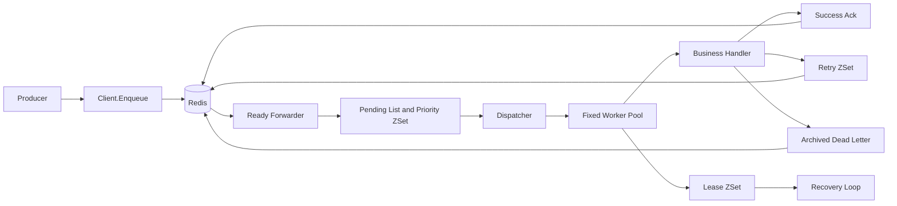

# Go-TaskEngine 架构说明

## 数据流

## 运行语义

- Redis 保存任务的持久状态，任务消息存放在队列对应的 Hash 中。
- pending 使用 List 保留队列结构，同时使用 priority ZSet 让高优先级任务先被领取。
- scheduled 和 retry 使用 Unix 毫秒时间戳作为 ZSet score。
- worker 领取任务时写入 active 和 lease；heartbeat 定期延长 lease。
- handler 成功后删除任务；失败后按 `2^n` 计算重试时间，超过次数后进入 archived。
- 这是至少一次执行语义。进程崩溃、网络中断或 shutdown 超时后，任务可能被再次执行，业务 handler 应具备幂等性。
- shutdown 超时只保证任务进入 requeue/recovery 路径，不保证忽略 context 的外部函数立即停止。

## 重要配置

- `server.Config.Concurrency`：单个 server 的固定 worker 数量。
- `server.Config.LeaseDuration`：active 任务租约时长。
- `server.Config.RetryBaseDelay` 和 `RetryMaxDelay`：重试退避起点和上限。
- `server.Config.TokenBucket`：可选的共享 Redis 令牌桶。
- `server.Config.Metrics`：可选的实际 worker 路径计数器。
