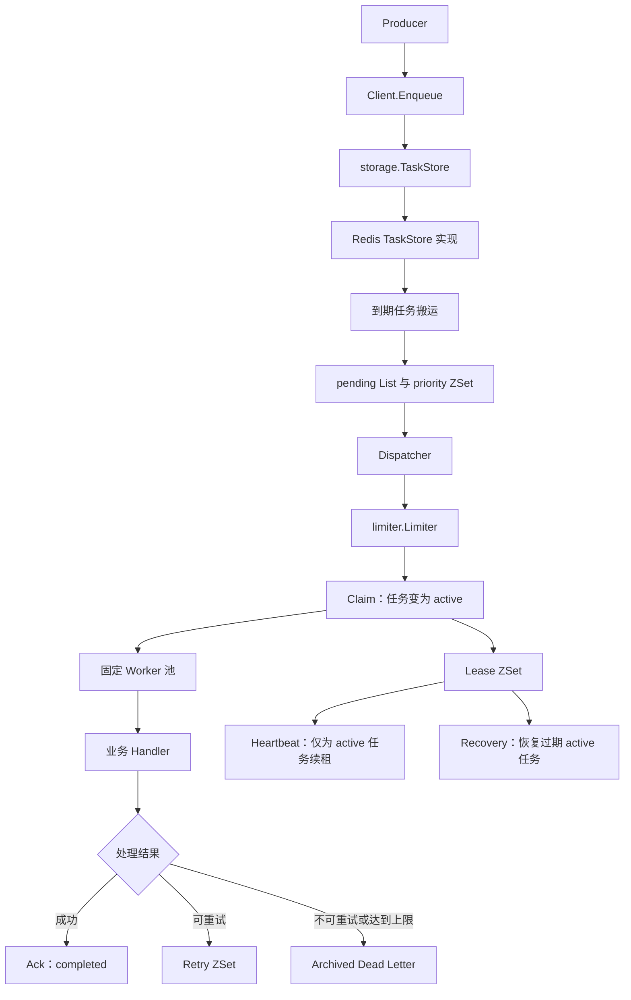
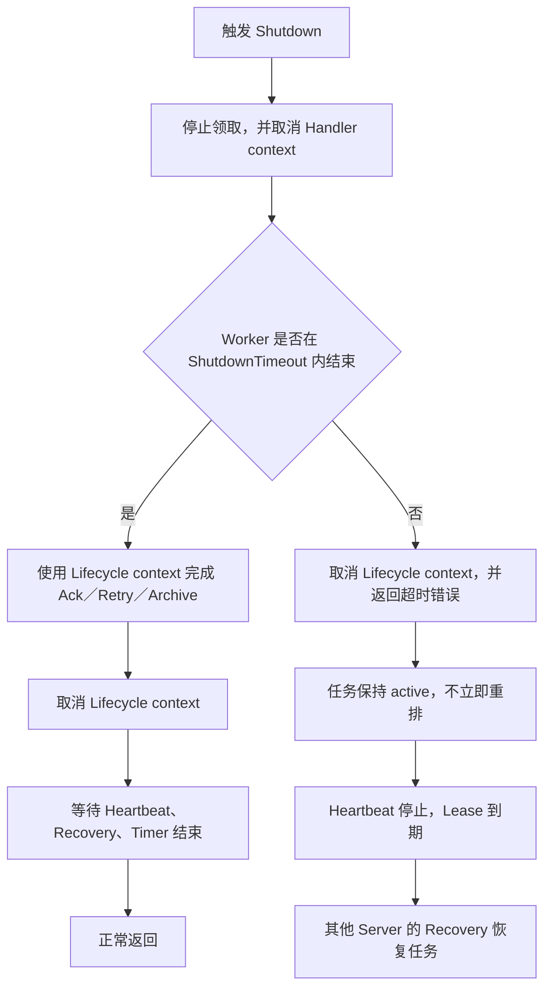

# Go-TaskEngine 架构说明

## 目录即架构

```text
Go-TaskEngine/
├── client/
│   └── 创建任务并通过存储契约入队
├── model/
│   └── 定义 TaskMessage 与 TaskState
├── storage/
│   ├── 定义 TaskStore
│   └── 定义跨实现错误契约
├── limiter/
│   ├── 定义 Limiter 接口
│   └── 公开 Redis TokenBucket 兼容入口
├── server/
│   ├── 调度与固定 worker 池
│   ├── handler context
│   └── lifecycle context
├── redisstore/
│   └── 公开 Redis TaskStore
└── internal/
    ├── limiter/
    │   └── Redis 令牌桶实现
    ├── redisstore/
    │   ├── Redis Lua 状态转换
    │   ├── HMGET 原子任务读取
    │   └── Lua 原子 lease 续期
    └── timer/
        └── 本地调度唤醒
```

核心依赖方向为：

```text
client ──────→ model
   │
   └─────────→ 入队能力

server ──────→ storage ──────→ model
   │
   └─────────→ limiter

redisstore ──→ internal/redisstore ──→ storage、model
limiter ─────→ internal/limiter
```

`server` 不依赖 Redis 存储具体类型。它依赖 `storage.TaskStore` 和 `limiter.Limiter`；Redis 是当前公开实现。

## 任务数据流



## 存储错误契约

- `storage.ErrQueueEmpty`：`Claim` 当前没有可领取任务，dispatcher 将继续轮询。
- `storage.ErrTaskNotFound`：按 queue 和 ID 查询不到任务，应作为查询结果或存储错误处理，不能解释成空队列。
- `storage.ErrNoTask`：兼容旧实现的根错误。两个新错误都满足 `errors.Is(err, storage.ErrNoTask)`。
- `storage.IsQueueEmpty(err)`：区分新错误，同时兼容旧 `TaskStore` 直接返回或包装 `ErrNoTask`。
- `storage.ErrTaskExists`：任务 ID 已存在。
- `storage.ErrInvalidTransition`：持久状态转换与当前状态不匹配。

Redis 公开包保留旧错误名称，并转发新的 `ErrQueueEmpty` 与 `ErrTaskNotFound`。

## Redis 一致性

- 任务消息保存在队列对应的 Hash 中。
- `Get` 使用单次 `HMGET` 同时读取 `msg` 和 `state`。消息不存在时返回 `ErrTaskNotFound`；state 缺失、JSON 损坏或 Redis 命令失败时返回错误，不返回半完整任务。
- pending 使用 List 保留队列结构，同时使用 priority ZSet 让高优先级任务先被领取。
- scheduled 和 retry 使用 Unix 毫秒时间戳作为 ZSet score。
- worker 领取任务时写入 active 和 lease。
- heartbeat 的 `ExtendLease` 使用 Lua 检查 Redis 当前 state。只有 active 任务会更新 lease；completed、retry、archived 或不存在的任务会清理陈旧 lease。
- Ack、Retry、Archive 与 ExtendLease 都通过 Redis 脚本串行执行，避免旧 heartbeat 快照在状态转换后重建 lease。
- handler 成功后保留任务 Hash，写入 `completed` 状态和完成时间；失败后按 `2^n` 计算重试时间，超过次数后进入 archived。
- scheduled 和 retry 的到期搬运由 dispatcher 每轮调用 Redis Lua 批量脚本完成。Time Wheel 只负责本地唤醒下一轮扫描，不保存任务状态，也不替代 Redis。

## 生命周期与关闭

服务器使用两个上下文：

- handler context：停止领取时立即取消，通知业务 handler 结束。
- lifecycle context：供调度、状态转换、heartbeat 和 recovery 的存储调用使用；worker 正常结束或关闭超时时取消。



`ShutdownTimeout` 是整个关闭过程的严格上限。超时后不立即 requeue 仍在运行的任务，因为忽略取消的旧 handler 可能继续执行；立即重排会主动制造同一任务的并发重复处理。任务保持 active，停止续租后通过 lease recovery 恢复。

这是至少一次执行语义。进程崩溃、网络中断、handler 超时或 shutdown 超时后，任务仍可能被再次执行，业务 handler 必须具备幂等性。

## 重要配置

- `server.Config.Concurrency`：单个 server 的固定 worker 数量。
- `server.Config.LeaseDuration`：active 任务租约时长。
- `server.Config.RetryBaseDelay` 和 `RetryMaxDelay`：重试退避起点和上限。
- `server.Config.RetryJitter`：重试退避的对称随机比例，范围为 `0` 到 `1`。
- `server.Config.TokenBucket`：类型为 `limiter.Limiter`。字段名为兼容现有配置保留；Redis `TokenBucket` 是一个实现，也可接入满足接口的其他限流器。
- `server.Config.TokenAmount`：每次领取任务消耗的令牌数，不能大于 limiter 容量。
- `server.Config.Metrics`：可选的实际 worker 路径计数器。
- `server.Config.HeartbeatInterval` 必须小于 `server.Config.LeaseDuration`；不满足时 `Start` 返回 `ErrInvalidConfig`。

## 验证分层

- miniredis 测试用于快速验证 Lua 状态转换、调度和并发逻辑，不代表真实 Redis 网络性能。
- `GTE_REAL_REDIS=1` 的测试连接本机真实 Redis，验证 Redis 协议、进程和网络边界；它们不提供生产容量结论。
- `TimeWheel` 只负责本地 dispatcher 唤醒，scheduled 和 retry 状态仍持久化在 Redis。
- 真实 Redis 的 benchmark 与功能验收命令、机器条件和采样限制记录在 `docs/benchmark-report.md`。
- CI 工作流位于 `.github/workflows/ci.yml`，执行测试、race、构建和 vet 检查。

## 延时调度验证边界

- `internal/timer.TimeWheel` 支持注入时钟、并发 Schedule／Cancel 和显式 `Wake`。
- 回调串行执行，慢回调会延迟后续回调；已经开始执行的回调不会被取消。
- 测试覆盖 50ms 延时、500ms 跨秒边界延时、重试到期搬运、重启后发现延时任务和双 dispatcher 竞争。
- Windows 本地历史测试误差约为 1.4–6.3ms；该范围只记录本地测试结果，不代表生产环境延时保证。
