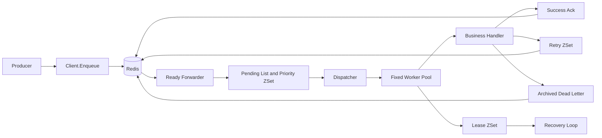

# Go-TaskEngine 架构说明

## 数据流

## 运行语义

- Redis 保存任务的持久状态，任务消息存放在队列对应的 Hash 中。
- pending 使用 List 保留队列结构，同时使用 priority ZSet 让高优先级任务先被领取。
- scheduled 和 retry 使用 Unix 毫秒时间戳作为 ZSet score。
- worker 领取任务时写入 active 和 lease；heartbeat 定期延长 lease。
- handler 成功后保留任务 Hash，写入 `completed` 状态和完成时间；失败后按 `2^n` 计算重试时间，超过次数后进入 archived。
- scheduled 和 retry 的到期搬运由 dispatcher 每轮调用 Redis Lua 批量脚本完成；Time Wheel 只负责在本地唤醒下一轮扫描，不保存任务状态，也不替代 Redis。重复 dispatcher 依靠 Lua 的原子移除保证同一任务只进入 pending 一次。
- 这是至少一次执行语义。进程崩溃、网络中断或 shutdown 超时后，任务可能被再次执行，业务 handler 应具备幂等性。
- shutdown 超时只保证任务进入 requeue/recovery 路径，不保证忽略 context 的外部函数立即停止。

## 重要配置

- `server.Config.Concurrency`：单个 server 的固定 worker 数量。
- `server.Config.LeaseDuration`：active 任务租约时长。
- `server.Config.RetryBaseDelay` 和 `RetryMaxDelay`：重试退避起点和上限。
- `server.Config.TokenBucket`：可选的共享 Redis 令牌桶。
- `server.Config.Metrics`：可选的实际 worker 路径计数器。
- `server.Config.HeartbeatInterval` 必须小于 `server.Config.LeaseDuration`；不满足时 `Start` 返回 `ErrInvalidConfig`。

## 阶段 4 延时调度验证

- `internal/timer.TimeWheel` 支持注入时钟、并发 Schedule/Cancel 和显式 `Wake`。回调串行执行，慢回调会延迟后续回调；已经开始执行的回调不会被取消。
- 阶段 4 测试覆盖 50ms 延时、500ms 跨秒边界延时、重试到期搬运、重启后发现延时任务和双 dispatcher 竞争。连续 5 次 Windows 测试中，任务实际执行时间均晚于目标，误差约为 1.4–6.3ms；该范围只记录本地测试结果，不代表生产环境延时保证。
