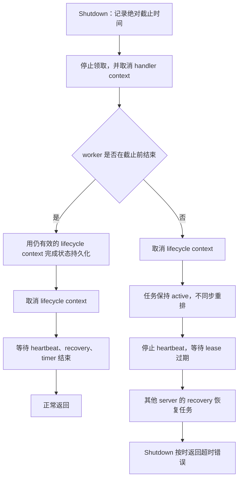
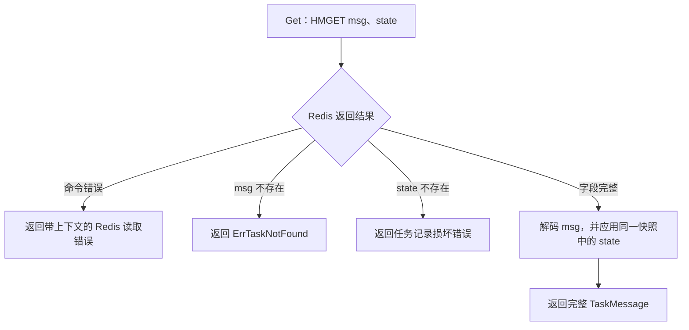
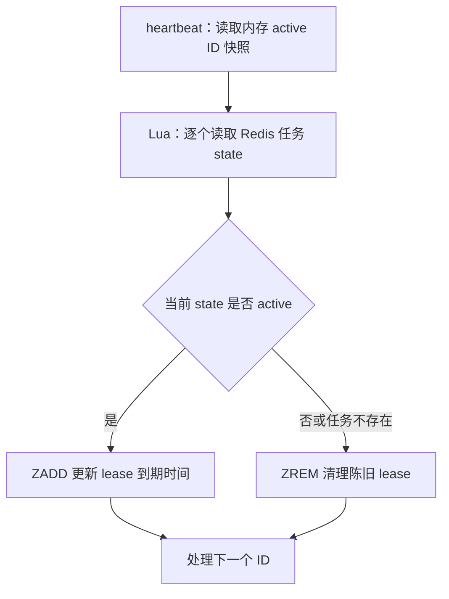

# Go-TaskEngine 契约与可靠性硬化设计

日期：2026-08-31

## 目标

修复上一轮架构审计留下的五项问题：

1. 区分“队列为空”和“任务不存在”，同时兼容旧 `ErrNoTask` 判断。
2. 让 `server` 依赖限流接口，而不是 Redis `TokenBucket` 具体类型。
3. 让服务端存储调用受生命周期上下文约束，使 `ShutdownTimeout` 成为严格上限。
4. 原子读取 Redis 中的任务消息和状态，不返回半完整任务。
5. 原子校验 active 状态后续租，防止旧 heartbeat 重建陈旧 lease。

本次保持 `TaskStore.Claim` 签名和 `Config.TokenBucket` 字段名，不引入 V2 接口或适配器目录。

## 当前目录与问题

```text
Go-TaskEngine/
├── storage/
│   ├── TaskStore
│   └── ErrNoTask 同时表示空队列和任务不存在
├── limiter/
│   └── 只公开 Redis TokenBucket 具体类型
├── server/
│   ├── Config.TokenBucket 使用具体类型
│   ├── 多个存储调用使用 context.Background
│   └── Shutdown 超时后同步重排仍在运行的任务
└── internal/redisstore/
    ├── Get 分两次读取 msg 和 state，并忽略 state 读取错误
    └── ExtendLease 无条件写入 lease
```

根因不是单一实现错误，而是契约语义、生命周期和 Redis 状态转换边界没有完整表达：

- 存储接口无法让调用方准确区分正常空队列和按 ID 查询失败。
- 服务端需要的限流能力没有接口化。
- handler context 与服务器 lifecycle context 职责混淆，状态转换绕过关闭期限。
- Redis 的关联字段和状态校验没有放在同一个原子操作中。

## 目标目录与依赖

```text
Go-TaskEngine/
├── model/
│   └── TaskMessage、TaskState
├── storage/
│   ├── TaskStore
│   ├── ErrQueueEmpty
│   ├── ErrTaskNotFound
│   ├── ErrNoTask 兼容根错误
│   └── IsQueueEmpty
├── limiter/
│   ├── Limiter 接口
│   ├── Result
│   └── TokenBucket 公开兼容入口
├── server/
│   ├── Config.TokenBucket limiter.Limiter
│   ├── handler context
│   └── lifecycle context
└── internal/
    ├── limiter/
    │   └── Redis TokenBucket 实现
    └── redisstore/
        ├── HMGET 原子任务读取
        └── Lua 原子 lease 续期
```

依赖方向：

```text
server ───────→ storage ───────→ model
   │
   └──────────→ limiter
                    ↑
          internal/limiter

internal/redisstore ───────────→ storage、model
```

`server` 只依赖存储和限流能力契约。Redis 仍是当前实现，但不再由服务端配置类型强制绑定。

## 一、存储错误语义

`storage` 保留旧的 `ErrNoTask`，并新增：

- `ErrQueueEmpty`：`Claim` 当前没有任务可领取。
- `ErrTaskNotFound`：`Get` 按 queue 和 ID 查不到任务。
- `IsQueueEmpty(error) bool`：识别新错误，也兼容第三方旧实现直接返回或包装 `ErrNoTask`。

两个新错误都包装旧 `ErrNoTask`，因此：

```go
errors.Is(storage.ErrQueueEmpty, storage.ErrNoTask) == true
errors.Is(storage.ErrTaskNotFound, storage.ErrNoTask) == true
```

`IsQueueEmpty` 必须先排除 `ErrTaskNotFound`，再兼容剩余的旧 `ErrNoTask`。`server` 使用 `IsQueueEmpty`，不再把所有 `ErrNoTask` 子错误都解释成空队列。

`redisstore` 继续公开 `ErrNoTask`，并增加 `ErrQueueEmpty`、`ErrTaskNotFound` 兼容别名。

直接比较 `err == ErrNoTask` 不作为新契约保证；Go 调用方应使用 `errors.Is` 或 `storage.IsQueueEmpty`。仓库当前调用均使用 `errors.Is`。

## 二、限流接口

在公开 `limiter` 包定义：

```go
type Limiter interface {
    Acquire(context.Context, float64) (Result, error)
    Validate() error
    Capacity() float64
}
```

`TokenBucket` 继续由现有构造函数创建，并实现该接口。`server.Config.TokenBucket` 保留字段名，但类型由 `*limiter.TokenBucket` 改为 `limiter.Limiter`。

保留字段名的原因是避免修改现有配置字面量；改成接口后，自定义内存限流器和未来其他基础设施实现都能接入。`Validate` 和 `Capacity` 属于服务端启动配置校验需要的最小能力，避免令牌量永久大于容量而持续拒绝任务。

## 三、生命周期上下文与关闭语义

服务器继续维护两个上下文：

- `handlerCtx`：在停止接收任务时取消，用于通知业务 handler 尽快结束。
- `ctx`：服务器 lifecycle context，用于调度和持久化状态转换；仅在 worker 正常结束后或 `ShutdownTimeout` 到期时取消。

所有服务端内部存储调用使用 lifecycle context：

- dispatch：`MoveReady`、`PendingCount`、`Claim`、停止时的 `Requeue`。
- process：`AckSuccess`、`ScheduleRetry`、`Archive`。
- heartbeat：`ExtendLease`。
- recovery：`ExpiredIDs`、`Get`、`ScheduleRetry`、`Archive`。

### Shutdown



`ShutdownTimeout` 是整个关闭过程的严格上限。超时后删除 `requeueActive` 同步路径，不再使用无界 `context.Background()`。

这是有意的行为修正：handler 忽略取消时仍可能运行，立即把同一任务放回 pending 会造成旧 handler 和新 worker 并发执行。保持 active 并停止续租，随后由 lease recovery 恢复，虽然仍是至少一次语义，但避免主动制造并发重复执行。

### Stop

`Stop` 继续立即取消 handler 和 lifecycle context，不等待 worker。未持久化完成的 active 任务依赖 lease recovery。

存储实现仍必须遵守传入 context。若第三方实现忽略 context，Go 无法强制终止其方法；测试和文档会明确这一契约。

## 四、原子任务读取

`internal/redisstore.Get` 使用一次 Redis `HMGET` 同时读取 `msg` 和 `state`：



一次 `HMGET` 同时解决两个问题：

- 不再忽略第二次读取 `state` 的错误。
- 不会在两次命令之间跨越 Ack、Retry、Archive 等状态转换，避免消息和状态来自不同快照。

JSON 解码错误、缺少 state 和 Redis 返回形状异常都返回明确错误，不返回半完整任务。

## 五、原子 lease 续期

`ExtendLease` 改用一个 Lua 脚本处理同一队列的一批 ID。脚本接收 lease key、每个任务 key、目标 lease 时间和 ID：



脚本和 Ack、Retry、Archive 脚本在 Redis 中串行执行：

- heartbeat 先执行时，只会延长仍为 active 的任务；后续状态转换会删除 lease。
- 状态转换先执行时，heartbeat 看到非 active，并删除旧快照可能对应的陈旧 lease。

所有 key 使用同一 queue hash tag，保持 Redis Cluster 单槽脚本约束。

## 六、测试策略

每项生产修改都遵循失败—最小实现—回归：

1. 错误契约：验证两个新错误可区分，且都兼容 `ErrNoTask`；旧 store 返回 `ErrNoTask` 时 server 仍按空队列处理。
2. 限流接口：使用不依赖 Redis 的自定义 limiter 配置 server，验证启动校验与领取控制。
3. 生命周期：使用阻塞到 `ctx.Done()` 的假存储，验证状态转换和维护调用收到 lifecycle 取消；验证 Shutdown 总耗时有界。
4. 超时恢复：验证忽略取消的 handler 超时后任务保持 active、不立即 pending；释放旧 handler 并使 lease 过期后，由第二个 server recovery 恢复。
5. 原子读取：验证不存在返回 `ErrTaskNotFound`；删除 state 后 `Get` 返回错误而不是消息；正常状态读取不回归。
6. 原子续租：验证 active 任务续租；completed、retry、archived 或不存在任务不会被写入 lease，并会清理陈旧记录。
7. 回归：运行普通测试、竞态测试、构建、vet、差异检查和生产依赖边界检查。

验证命令：

```powershell
go test ./storage ./limiter ./internal/redisstore ./redisstore ./server -count=1
go test ./... -count=1
go test -race ./... -count=1
go build ./...
go vet ./...
git diff --check
```

## 七、兼容性与非目标

兼容：

- 保持 `TaskStore.Claim` 方法签名。
- 保持 `Config.TokenBucket` 字段名。
- 保持 `limiter.NewTokenBucket`、`NewScopedTokenBucket` 和 `TokenBucket`。
- 保持 `redisstore.ErrNoTask` 和 `storage.ErrNoTask`。
- 旧实现返回或包装 `ErrNoTask` 时，`storage.IsQueueEmpty` 继续识别。

有意变化：

- Redis `Claim` 新返回 `ErrQueueEmpty`，`Get` 新返回 `ErrTaskNotFound`。
- `Shutdown` 超时不再承诺任务立即进入 pending；任务通过 lease recovery 恢复。
- `Config.TokenBucket` 的静态字段类型从具体指针变成接口；常规配置字面量兼容，但依赖反射检查精确字段类型的外部代码会观察到变化。

非目标：

- 不把 `Claim` 改为 `msg、ok、err`。
- 不新增 `storage/v2`、`limiter/v2` 或适配器目录。
- 不改变 Redis key 命名和任务状态机集合。
- 不保证忽略 context 的第三方存储能被强制终止。
- 不修改 `My_learn/`、`docs/study_notes/`、`.gitignore` 或上一轮仅有行尾差异的文件。
