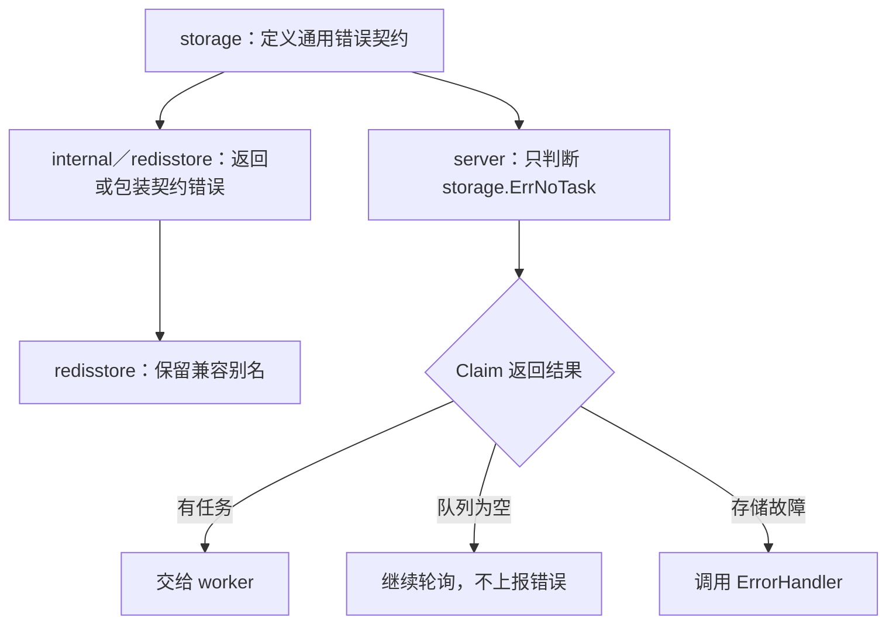

# 存储错误契约归位设计

日期：2026-08-31

## 目标

消除 `server` 对 Redis 存储实现错误的直接依赖，把跨实现都需要表达的存储结果归入 `storage` 契约，同时保持现有 `redisstore` 公共错误名称兼容。

本次只处理存储错误契约及其直接文档、测试影响；令牌桶抽象、`Claim` 返回值重构和“队列为空／任务不存在”语义拆分作为后续独立设计，不与本次兼容修复混合。

## 当前目录与依赖

```text
Go-TaskEngine/
├── model/
│   └── 任务数据契约
├── storage/
│   └── TaskStore 接口
├── server/
│   ├── 依赖 storage.TaskStore
│   └── 直接依赖 redisstore.ErrNoTask
├── redisstore/
│   └── 转发 internal/redisstore 的类型、构造函数和错误
└── internal/
    └── redisstore/
        └── 定义 ErrNoTask、ErrTaskExists、ErrInvalidTransition
```

当前问题是接口方法位于 `storage`，但方法的通用结果语义位于 Redis 实现包。替换为其他 `TaskStore` 实现时，新实现必须依赖 Redis 包才能让 `server` 正确识别空队列。

## 目标目录与依赖

```text
Go-TaskEngine/
├── model/
│   └── 任务数据契约
├── storage/
│   ├── TaskStore 接口
│   └── ErrNoTask、ErrTaskExists、ErrInvalidTransition
├── server/
│   └── 只通过 storage 使用存储类型和错误语义
├── redisstore/
│   └── 保留三个公共错误名称，并作为 storage 错误的兼容别名
└── internal/
    └── redisstore/
        └── 实现 storage 契约并返回 storage 错误
```

目标依赖方向为：

```text
server ───────→ storage ───────→ model
                    ↑
internal/redisstore ┘
        ↑
redisstore
```

## 契约决定

`storage` 定义以下哨兵错误：

- `ErrNoTask`：当前操作没有可返回的任务。现阶段兼容既有行为，仍同时用于空队列和任务查找不存在。
- `ErrTaskExists`：入队或调度时任务标识已经存在。
- `ErrInvalidTransition`：请求的持久化状态转换与当前任务状态不一致。

`internal/redisstore` 不再创建独立错误值，而是引用 `storage` 中的错误。`redisstore` 继续导出原有三个名称，且这些名称与 `storage` 对应错误保持同一错误身份，因此既有 `errors.Is(err, redisstore.ErrNoTask)` 等调用继续成立。

`server` 删除 `redisstore` 导入，并改用 `errors.Is(err, storage.ErrNoTask)` 判断空队列。

## 错误数据流



## 兼容性

本次不改变 `TaskStore` 方法签名，不删除任何 `redisstore` 公共名称，不改变已有 Redis 正常路径的错误身份判断。

新增的 `storage` 错误是向后兼容的公共 API 扩展。已有调用方可以继续使用 `redisstore.ErrNoTask`，新存储实现和通用调用方应使用 `storage` 错误。

## 测试设计

测试按失败、实现、回归三个阶段执行：

1. 在 `storage` 测试中引用三个预期错误，确认实现前因符号不存在而失败。
2. 在 `redisstore` 公共 API 测试中断言三个兼容名称分别与 `storage` 错误具有相同身份。
3. 在 `server` 测试中使用非 Redis 的 `TaskStore` 假实现返回 `storage.ErrNoTask`，验证空队列不会进入 `ErrorHandler`，证明核心调度不依赖 Redis 错误。
4. 运行全量普通测试、竞态测试、构建和静态检查。

验证命令：

```powershell
go test ./storage ./redisstore ./server
go test ./...
go test -race ./...
go build ./...
go vet ./...
```

## 本轮架构审计记录

### 本次一并修复

- `ErrNoTask` 位于 Redis 实现层，却被通用 `server` 使用。
- `ErrTaskExists` 和 `ErrInvalidTransition` 同样属于通用存储状态语义，却位于 Redis 实现层。
- `storage.TaskStore` 缺少方法结果和哨兵错误语义说明。
- `Server` 和公共模型注释将抽象对象写死为 Redis，需要改成持久化存储或任务存储表述；Redis 专属说明只保留在 Redis 实现包。

### 后续独立设计

- `ErrNoTask` 同时表达“当前无可领取任务”和“按 ID 查无任务”，语义过载。更清晰的设计是让 `Claim` 返回 `msg、ok、err`，并为查询定义 `ErrTaskNotFound`；这会改变公共契约，本次不处理。
- `server.Config.TokenBucket` 直接使用 Redis 令牌桶具体类型。若服务端目标是基础设施无关，应定义窄限流接口并让 Redis 令牌桶实现该接口；该改动涉及公共配置 API 和校验能力，本次不处理。
- `server` 多处状态转换和维护操作使用 `context.Background()`，存储调用阻塞时可能削弱关闭超时的约束。该问题属于生命周期与可靠性设计，需要独立测试和超时策略，本次只记录。

## 非目标

- 不改变 `Claim` 方法签名。
- 不删除 `redisstore` 兼容错误。
- 不重构令牌桶接口。
- 不调整 Redis Lua 状态机。
- 不修改 `My_learn` 和学习笔记目录。
