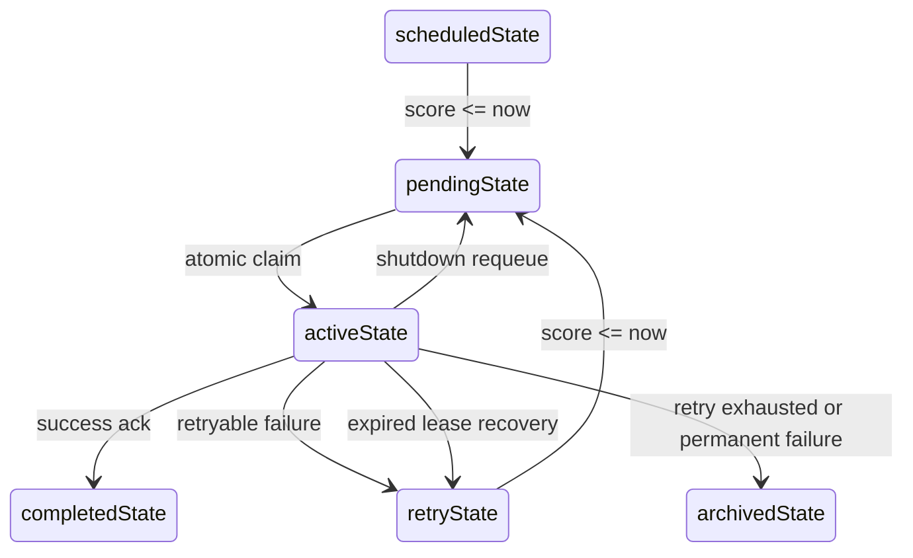

# Redis 状态机

## Key 约定

队列 `q` 的 key 前缀是 `gte:{q}:`：

- `task:<id>`：任务 Hash，保存序列化消息、状态、优先级和排序分数。
- `pending`：待处理任务 List。
- `pending_rank`：待处理任务优先级 ZSet。
- `scheduled`：计划任务 ZSet，score 为 Unix 毫秒时间戳。
- `retry`：重试任务 ZSet，score 为下次执行的 Unix 毫秒时间戳。
- `active`：执行中的任务 List。
- `lease`：执行中任务的租约到期 ZSet。
- `archived`：死信/失败归档 ZSet。

## 状态转换

每次转换都由 Redis Lua 脚本完成，或由单个 lease 延长命令完成。读取任务后，server 仍需检查 Redis 中的状态，防止已被其他流程接管的任务被旧 worker 再次确认。
